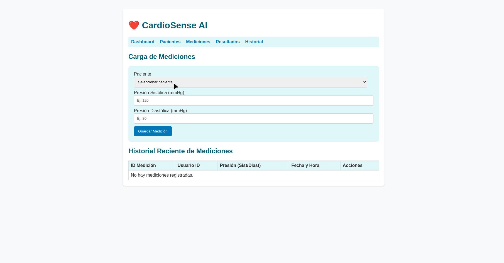

# ❤️ CardioSense AI

CardioSense AI is a web application developed with **Flask** to monitor cardiovascular health. It allows users to log blood pressure measurements, and it is designed to provide AI-driven risk analysis and personalized recommendations.

---

## 🚀 Getting Started

Follow these steps to get the project running locally.

### Prerequisites

* Python 3.8+
* pip

### Installation

1.  **Clone the repository:**
    ```bash
    git clone <your-repository-url>
    cd CardioSenseAI
    ```

2.  **Create and activate a virtual environment (recommended):**
    ```bash
    # For macOS/Linux
    python3 -m venv venv
    source venv/bin/activate

    # For Windows
    py -m venv venv
    .\venv\Scripts\activate
    ```

3.  **Install the required dependencies:**
    ```bash
    pip install -r requirements.txt
    ```

4.  **Run the application:**
    ```bash
    python app.py
    ```
    The application will be available at `http://127.0.0.1:5000`.

---

## 📸 Application Preview

Here is a quick demonstration of the main functionalities of the app.

*(Replace 'Sample.gif' with the name of your GIF file in the same directory)*


---

## 🛠️ Tech Stack

* **Backend:** Python, Flask
* **Database ORM:** Flask-SQLAlchemy
* **Database Engine:** SQLite
* **Frontend:** HTML, CSS, Jinja2